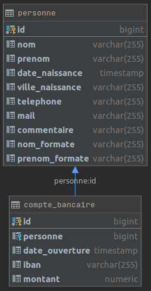
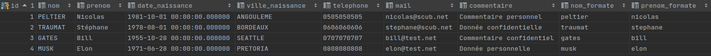
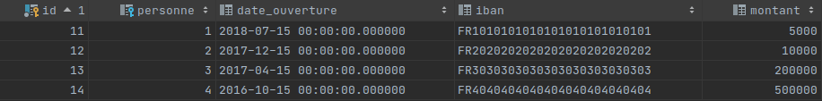
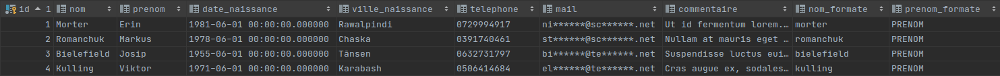
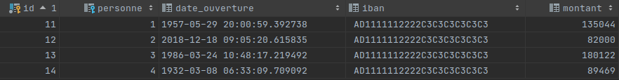

La protection des données personnelles est un point crucial de tout système d'information. Il l'est devenu d'autant plus depuis la mise en place du RGPD il y a quelques années.
Ce règlement a contraint les professionnels à mettre en place des solutions pour assurer la confidentialité de ces données et ainsi, respecter la vie privée.

Parmi les points critiques d'un système d'information, on trouve, entre autre, les bases de données qui peuvent contenir une quantité incroyable de données sensibles (noms, coordonnées, informations bancaires, ...).
Mais ces bases de production (et leur contenu) sont souvent utilisées par les développeurs eux-mêmes, des prestataires externes, ... pour faire des tests de leurs applications ou logiciels, et tous ces acteurs peuvent donc avoir accès à toutes ces données sensibles.
Une des solutions possibles est d'anonymiser ces bases pour assurer la confidentialité des données personnelles, et ainsi éviter d'identifier des personnes en particulier.

Dans cet article, je vais vous présenter un outil permettant d'anonymiser une base de données PostgreSQL pour pouvoir l'utiliser dans un environnement de développement (ou de recette) en préservant la confidentialité des données : <a href="https://postgresql-anonymizer.readthedocs.io/en/latest/" target="_blank">PostgreSQL Anonymizer</a>.

## RGPD, données personnelles et anonymisation
Le RGPD (Règlement Général sur la Protection des Données) règlemente le traitement des données personnelles dans l'Union Européenne et est entré en vigueur le 25 mai 2018.
Il oblige les entités collectant des données personnelles à se mettre dans une démarche et une réflexion pour assurer la protection de ces données :
- ne collecter que les données nécessaires
- être transparent sur les données collectées
- permettre à la personne concernée d'accéder, de modifier ou supprimer ces données
- ne conserver ces données que le temps nécessaire
- sécuriser ces données

Mais qu'est-ce qu'une donnée personnelle ? C'est une information permettant d'identifier une personne physique :
- directement : par son nom ou son prénom
- indirectement : par son numéro de téléphone, son adresse, un numéro d'identification, ...
Avec ces données, il peut être plus ou moins facile de retrouver une personne et de recueillir énormément d'informations la concernant en recoupant toutes ces données.
  
Pour assurer la sécurisation des données et préserver leur confidentialité, la CNIL propose, entre autres, comme solution, l'anonymisation de ces données, empêchant ainsi l'identification d'une personne physique de manière irréversible.
L'anonymisation consiste notamment à supprimer les données d'identification directe (nom, prénom, ...), les valeurs rares (les personnes centenaires ou les personnes vivant dans des endroits peu peuplés seront facilement identifiables), ... tout en conservant un jeu de données cohérent et utilisable.
L'anonymisation peut se faire à l'aide de différentes techniques :
- la **_randomisation_** : remplace les données par des valeurs aléatoires pour éviter de déduire de nouvelles informations sur la personne (ex : nom aléatoire, adresse aléatoire, ...)
- la **_généralisation_** : modifie l'échelle des valeurs pour éviter d'individualiser une personne (ex : ramener la date de naissance au 1er janvier, ramener la ville à la préfecture du département, ...)

Attention, il faut différencier l'anonymisation et la pseudonymisation : la pseudonymisation remplace une donnée directement identifiante (nom, prénom, ...) par une donnée indirectement identifiante (pseudo, numéro, ...) ce qui permet tout de même de retrouver d'autres infos personnelles. Contrairement à l'anonymisation qui est un processus irréversible, la pseudonymisation est un processus réverssible.
Cependant, la pseudonymisation reste une mesure recommandée, à défaut d'anonymisation complète. Le but est de compliquer la récupération des données personnelles.

Le RGPD se base sur 3 critères pour garantir l'anonymat des données :
>- l’**individualisation** : il ne doit pas être possible d’isoler un individu dans le jeu de données
>- la **corrélation** : il ne doit pas être possible de relier entre eux des ensembles de données distincts concernant un même individu
>- l’**inférence** : il ne doit pas être possible de déduire, de façon quasi certaine, de nouvelles informations sur un individu

_(source <a href="https://www.cnil.fr/fr/lanonymisation-de-donnees-personnelles" target="_blank">CNIL</a>)_

## Présentation de PostgreSQL Anonymizer

PostgreSQL Anonymizer est une extension de PostgreSQL permettant d'_anonymiser_ une base de données. Elle est, à l'heure où j'écris cet article, en version beta mais est très performante dans la version actuelle.

PostgreSQL Anonymizer permet d'anonymiser une base en déclarant des règles de "masquage" sur les colonnes "sensibles".


PostgreSQL Anonymizer propose 3 façons d'anonymiser une base de données :
- la **génération d'un dump anonyme** à partir d'une base de données source. Cette solution préserve le contenu de la base de donnée source. C'est cette solution que je vais mettre en oeuvre dans la suite de l'article. 
- le **masquage statique** qui anonymise directement la base de données source et altère donc définitivement les données.
- le **masquage dynamique** qui anonymise "à la volée" les données masquées pour un rôle d'utilisateur donné.

PostgreSQL Anonymizer contient tout un ensemble de fonctions de masquage basiques :
- fonctions de **destruction** qui permettent de remplacer la valeur originale par une constante
- fonctions **aléatoires** qui permettent de générer aléatoirement une valeur : texte, date, nombre, ...
- fonctions **fake** qui permettent de générer aléatoirement des valeurs issues d'un référentiel de valeurs possibles : nom, prénom, ville, pays, lorem ipsum, ... Ces référentiels sont des tables initialisées lors de l'initialisation de l'extension.
- fonctions de **pseudonymisation** qui permettent de générer des valeurs à partir de la valeur originale et d'un référentiel de valeurs possibles : nom, prénom, ville, pays, ... Attention, ces fonctions sont déterministes : pour la même valeur de départ, ce sera toujours la même valeur qui sera générée !
- fonctions de **brouillage partiel** qui permettent de masquer partiellement la valeur originale avec un caractère spécifique : numéro de téléphone (06\*\*\*\*\*\*\*\*), mail (te\*\*\*@gm\*\*\*.com)

PostgreSQL Anonymizer permet aussi d'utiliser ses propres fonctions de masquage personnalisées pour des besoins spécifiques ou un peu plus complexes.

PostgreSQL Anonymizer propose une image docker qui contient PostgreSQL accompagné de l'extension PostgreSQL Anonymizer.
Cette image docker évite d'installer l'extension PostgreSQL Anonymizer directement sur la base de production (non intrusif), et permet ainsi de cloisonner le processus d'anonymisation de cette base (ex : sur un autre serveur) sans interférer avec la base originale.

## Mise en oeuvre
Dans cet exemple, nous allons générer avec PostgreSQL Anonymizer, un dump anonymisé à partir d'un dump d'une base non-anonymisée (ex : une base de prod). Pour cela, nous allons utiliser l'image docker de l'extension.

### Pré-requis :
  - Etre sous Ubuntu.
  - `docker` doit être installé sur le poste. Voir <a href="https://docs.docker.com/engine/install/ubuntu/" target="_blank">la page de la documentation officielle</a> ou <a href="https://www.digitalocean.com/community/tutorials/how-to-install-and-use-docker-on-ubuntu-20-04-fr" target="_blank">cette page</a>.
  - Au moment où cet article est écrit, l'exemple suivant se base sur la version 0.8 de PostgreSQL Anonymizer et la version 13.1 de PostgreSQL.

### Présentation de l'exemple
Nous allons prendre un exemple simpliste d'une base de données bancaires contenant une table **_personne_** avec leurs nom, prénom, date de naissance, coordonnées et commentaire et une table **_compte_bancaire_** d'une personne contenant la date d'ouverture, l'IBAN et le montant qu'il y a sur le compte.

<a href="https://scub-france.github.io/anonymisation-base-de-donnees-avec-postgresql-anonymizer/db_compte.png" target="_blank"></a>

Voici le contenu des tables :

<a href="https://scub-france.github.io/anonymisation-base-de-donnees-avec-postgresql-anonymizer/table_personne.png" target="_blank"></a>

<a href="https://scub-france.github.io/anonymisation-base-de-donnees-avec-postgresql-anonymizer/table_compte_bancaire.png" target="_blank"></a>

### Installation de PostgresSQL Anonymizer
Récupérer la dernière version de l'image docker de PostgreSQL Anonymizer :
```bash
docker pull registry.gitlab.com/dalibo/postgresql_anonymizer
```

Lancer un conteneur docker de PostgreSQL Anonymizer nommé **_test_pganonymizer_container_** en spécifiant les identifiants Postgres correspondants à la base que vous souhaitez anonymiser (ici _test_pga_). Cela va lancer Postgres en ajoutant l'extension à PostgreSQL Anonymizer :
```bash
docker run -d --name test_pganonymizer_container -p 6543:5432 -e POSTGRES_USER=test_pga -e POSTGRES_PASSWORD=test_pga -e POSTGRES_DB=test_pga registry.gitlab.com/dalibo/postgresql_anonymizer
```

Récupérer le [script d'initialisation](./init_pg_anonymizer.sql) (_init_pg_anonymizer.sql_) de l'extension PostgreSQL Anonymizer :
```bash
wget https://scub-france.github.io/anonymisation-base-de-donnees-avec-postgresql-anonymizer/init_pg_anonymizer.sql
```
```sql
SELECT pg_catalog.set_config('search_path', 'public', false);
CREATE EXTENSION IF NOT EXISTS anon CASCADE;
SELECT anon.init();
```
Initialiser l'extension PostgreSQL Anonymizer sur la base de données _**test_pga**_ avec le script précédent :
```bash
cat init_pg_anonymizer.sql | docker exec -i test_pganonymizer_container psql -U test_pga
```

Si l'installation s'est bien passée, vous devriez voir dans les logs l'anonymisation d'une adresse mail :
```bash
     partial_email     
-----------------------
 te******@te******.net
(1 row)
```

A partir de là, vous avez un conteneur prêt pour générer un dump anonymisé de la base de données que vous souhaitez. Pour l'exemple, ce sera notre base de données bancaires.

Télécharger le dump source de la base de données bancaire [dump_source.sql](./dump_source.sql) :
```bash
wget https://scub-france.github.io/anonymisation-base-de-donnees-avec-postgresql-anonymizer/dump_source.sql
```

Restaurer la base de données bancaires dans le conteneur d'anonymisation :
```bash
cat dump_source.sql | docker exec -i test_pganonymizer_container psql -U test_pga
```

### Règles / Masques basiques
L'ajout d'une règle de masquage sur une colonne consiste en une requête SQL. Cet ajout se fait en déclarant la fonction à appliquer sur la colonne par l'intermédiaire du SECURITY LABEL et en passant les paramètres souhaités (nom de colonne, variable, constante, ...) :
```sql
SECURITY LABEL FOR anon ON COLUMN nom_colonne IS 'MASKED WITH FUNCTION nom_fonction(nom_colonne_ou_params)';
```
ou pour l'ajout d'une constante :
```sql
SECURITY LABEL FOR anon ON COLUMN nom_colonne IS 'MASKED WITH VALUE ''La constante''';
```

Voici la présentation de quelques fonctions de masquages que nous allons appliquer sur notre exemple :
- **_anon.fake_last_name()_** sur la colonne **_personne.nom_** : retourne aléatoirement un nom parmi les noms proposés par l'extension.
```sql
SECURITY LABEL FOR anon ON COLUMN public.personne.nom IS 'MASKED WITH FUNCTION anon.fake_last_name()';
```
- **_anon.fake_first_name()_** sur la colonne **_personne.prenom_** : retourne aléatoirement un prénom parmi les prénoms proposés par l'extension.
```sql
SECURITY LABEL FOR anon ON COLUMN public.personne.prenom IS 'MASKED WITH FUNCTION anon.fake_first_name()';
```
- **_anon.fake_city()_** sur la colonne **_personne.ville_naissance_** : retourne aléatoirement une ville parmi les villes proposées par l'extension.
```sql
SECURITY LABEL FOR anon ON COLUMN public.personne.ville_naissance IS 'MASKED WITH FUNCTION anon.fake_city()';
```
- **_anon.random_phone()_** sur la colonne **_personne.telephone_** : retourne aléatoirement un numéro de téléphone à 10 chiffres.
```sql
SECURITY LABEL FOR anon ON COLUMN public.personne.telephone IS 'MASKED WITH FUNCTION anon.random_phone()';
```
- **_anon.partial_email(email)_** sur la colonne **_personne.mail_** : retourne le mail passé en paramètre partiellement masqué
```sql
SECURITY LABEL FOR anon ON COLUMN public.personne.mail IS 'MASKED WITH FUNCTION anon.partial_email(mail)';
```
- **_anon.lorem_ipsum()_** sur la colonne **_personne.commentaire_** : retourne un extrait de _Lorem Ipsum_. Différents paramètres permettent de définir la longueur souhaitée (paragraphes, mots, caractères, ...).
```sql
SECURITY LABEL FOR anon ON COLUMN public.personne.commentaire IS 'MASKED WITH FUNCTION anon.lorem_ipsum(words := 5)';
```
- constante "PRENOM" sur la colonne **_personne.prenom_formate_** : retourne la constante demandée.
```sql
SECURITY LABEL FOR anon ON COLUMN public.personne.prenom_formate IS 'MASKED WITH VALUE ''PRENOM''';
```
- **_anon.random_date()_** sur la colonne **_compte_bancaire.date_ouverture_** : retourne aléatoirement une date.
```sql
SECURITY LABEL FOR anon ON COLUMN public.compte_bancaire.date_ouverture IS 'MASKED WITH FUNCTION anon.random_date()';
```
- **_anon.fake_iban()_** sur la colonne **_compte_bancaire.iban_** : retourne un IBAN.
```sql
SECURITY LABEL FOR anon ON COLUMN public.compte_bancaire.iban IS 'MASKED WITH FUNCTION anon.fake_iban()';
```
- **_anon.random_int_between(v1, v2)_** sur la colonne **_compte_bancaire.montant_** : retourne aléatoirement un entier appartenant à la plage demandée.
```sql
SECURITY LABEL FOR anon ON COLUMN public.compte_bancaire.montant IS 'MASKED WITH FUNCTION anon.random_int_between(5000, 200000)';
```

Pour un aperçu plus exhaustif des règles de masquage, consulter cette <a href="https://postgresql-anonymizer.readthedocs.io/en/latest/masking_functions/" target="_blank">page</a>.

### Règles / Masques personnalisés
Pour définir une règle de masquage personnalisée pour un comportement spécifique, il suffit d'écrire une fonction SQL qui implémente la règle et déclarer cette fonction comme règle sur la colonne souhaitée.
- Pour la date de naissance d'une personne, nous aimerions que cette date soit ramenée au premier juin de l'année de naissance. Pour cela, il faut écrire la fonction **_anon.date_naissance_tronquee(date_initiale)_** correspondante prenant en paramètre la date initiale et la déclarer sur la colonne souhaitée :

```sql
CREATE OR REPLACE FUNCTION anon.date_naissance_tronquee(date_initiale TIMESTAMP)
    RETURNS TEXT
    LANGUAGE plpgsql
AS
$$
BEGIN
RETURN date_trunc('year', initial_value) + interval '5 month';
END;
$$;

SECURITY LABEL FOR anon ON COLUMN public.personne.date_naissance IS 'MASKED WITH FUNCTION anon.date_naissance_tronquee(date_naissance)';
```

- Pour le nom formaté d'une personne, nous aimerions que cette valeur soit la valeur en minuscule du nom de la personne. Or, la valeur générée pour le nom de la personne est aléatoire (règle **_fake_last_name()_**). Il y a donc peu de chance que l'on génère à nouveau le même nom pour la colonne _nom_formate_.
Pour contourner ce problème, nous allons utiliser la fonction déterministe **_anon.pseudo_last_name('seed','salt')_** qui permet de retourner le même nom avec les mêmes paramètres. Cette fonction sera utilisée comme règle sur la colonne **_personne.nom_** et dans une nouvelle fonction personnalisée utilisée comme règle de la colonne **_personne.nom_formate_**.
Le seed sera la concaténation de l'identifiant et du nom de la personne pour qu'une autre personne ayant le même nom ait un nom "anonymisé" différent. Le salt sera une chaine aléatoire générée à l'initialisation des règles pour qu'une personne ait un nom "anonymisé" différent à chaque processus d'anonymisation.

```sql
CREATE OR REPLACE FUNCTION anon.nom_minuscule(seed TEXT, salt TEXT)
    RETURNS TEXT
    LANGUAGE plpgsql
AS
$$
BEGIN
RETURN lower(anon.pseudo_last_name(seed, salt));
END;
$$;

SECURITY LABEL FOR anon ON COLUMN public.personne.nom IS 'MASKED WITH FUNCTION anon.pseudo_last_name(nom || id, ''1234'')';
SECURITY LABEL FOR anon ON COLUMN public.personne.nom_formate IS 'MASKED WITH FUNCTION anon.nom_minuscule(nom || id, ''1234'')';
```

Toutes les règles déclarées précédemment sont disponibles dans le fichier [regles.sql](./regles.sql) :
```bash
wget https://scub-france.github.io/anonymisation-base-de-donnees-avec-postgresql-anonymizer/regles.sql
```
Déclarer l'ensemble des règles de masquage dans le conteneur d'anonymisation :
```bash
cat regles.sql | docker exec -i test_pganonymizer_container psql -U test_pga
```


### Génération du dump anonyme
Pour générer le dump anonyme de la base source, il faut utiliser la commande **_pg_dump_anon_** qui s'utilise comme la commande **_pg_dump_** :
```bash
docker exec -i test_pganonymizer_container pg_dump_anon -h localhost -U test_pga > dump_anonyme.sql
```

Une fois le dump anonyme restauré sur une autre base, voici le résultat de l'anonymisation :
<a href="https://scub-france.github.io/anonymisation-base-de-donnees-avec-postgresql-anonymizer/table_personne_anonyme.png" target="_blank"></a>

<a href="https://scub-france.github.io/anonymisation-base-de-donnees-avec-postgresql-anonymizer/table_compte_bancaire_anonyme.png" target="_blank"></a>

Une fois l'anonymisation terminé, vous pouvez faire un peu de nettoyage (arrêt et suppression du conteneur) :
```bash
docker container stop test_pganonymizer_container
docker container rm test_pganonymizer_container
```

## Avantages / Inconvénients
### Avantages
- Nombreuses fonctions d'anonymisation fournies pour les types de données les plus classiques.
- Possibilité d'ajouter ses propres règles.
- Processus d'anonymisation non intrusif en utilisation "docker".
- Fonctionne sur plusieurs schémas.
- Développeur réactif en cas de bug.

### Inconvénients
- Spécifique Postgres.
- Encore en version béta : nombreux bugs encore présents (avec possibilité de les contourner).
- Si l'on ne veut pas toucher à la base de production, il faut passer par une base intermédiaire temporaire pour effectuer le processus d'anonymisation, ce qui oblige à restaurer la base à anonymiser dans cette base temporaire.
- Le temps de traitement peut être très long si la base à anonymiser est volumineuse. Notamment lorsque l'on utilise la génération aléatoire pour les noms, prénoms, villes, ... : une requête **_select_** est lancée dans une table à chaque ligne et chaque colonne ayant ce type de règle. Une astuce est proposée plus bas pour accélérer le traitement.
- Les valeurs de séquences présentes dans la base source ne sont pas reprises dans le dump anonymisé généré. Ce bug est en cours de résolution.

### Problèmes génériques à l'anonymisation
- Difficulté à garder la cohérence des données : anonymiser certaines données peut potentiellement entraîner des erreurs techniques ou fonctionnelles dans l'application :
  - Date de naissance incohérente avec un numéro de sécurité sociale
  - Numéro de client anonymisé inexistant chez le fournisseur d'un web-service
- Pertinence de l'anonymisation d'une base de production : pour la recette ou le développement, ne faut-il pas plutôt se contenter d'une base de données avec quelques données fictives ?
- Faire la distinction entre **_anonymisation_** et **_pseudonymisation_**. Il faut toujours se poser la question : "_Est-il encore possible d'identifier la personne à partir des données que je suis en train d'anonymiser ?_"
  

## Astuces
Comme vu précédemment, le temps de traitement peut être long sur les bases volumineuses à cause des requêtes faites sur les tables de références pour générer des valeurs aléatoires (noms, villes, ...).
Pour éviter ces nombreux accès en base et avoir un traitement beaucoup plus rapide, vous pouvez remplacer les appels aux fonctions _**fake...()**_ par des fonctions personnalisées s'appuyant sur des tableaux de valeurs.
Voici un exemple d'une fonction de génération aléatoire de villes s'appuyant sur un tableau :
```sql
CREATE OR REPLACE FUNCTION anon.ville_personnalisee()
    RETURNS TEXT
    LANGUAGE plpgsql
AS
$$
BEGIN
    RETURN anon.random_in(ARRAY['Paris', 'Londres', 'Washington', 'Tokyo']);
END;
$$;
```

## Conclusion
PostgreSQL Anonymizer, avec ces nombreuses fonctions de masquage et de remplacement, est un outil très efficace pour générer des dumps anonymisés de votre base Postgres, et ainsi, se conformer au RGPD.
La principale difficulté va être dans le choix des différentes règles d'anonymisation afin d'assurer la confidentialité totale des données (ou du moins, de s'en approcher fortement).
Cette réflexion sur la confidentialité des données devrait se faire dès la conception de la base (quand c'est possible).


**Liens** :
- <a href="https://www.cnil.fr/fr/comprendre-le-rgpd" target="_blank">Page de la CNIL sur le RGPD</a>
- <a href="https://gitlab.com/dalibo/postgresql_anonymizer" target="_blank">Projet Git de PostgreSQL Anonymizer</a>
- <a href="https://postgresql-anonymizer.readthedocs.io/en/stable/" target="_blank">Documentation de PostgreSQL Anonymizer</a>
